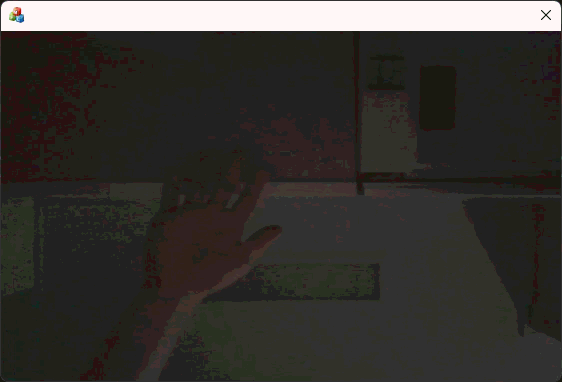
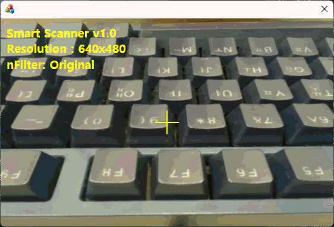
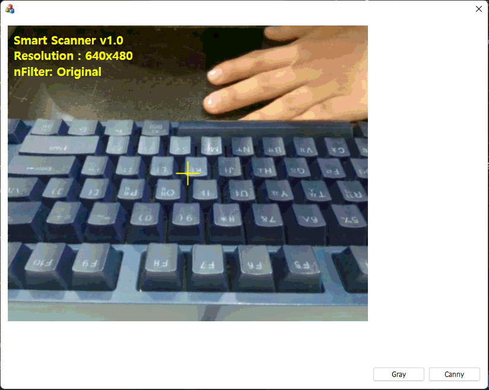
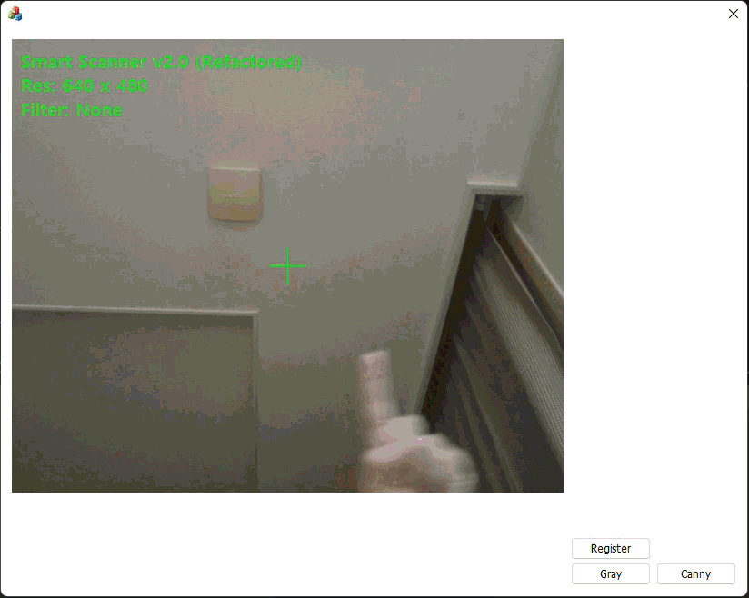

# Smart Desktop Scanner

**Smart Desktop Scanner**는 MFC 환경에서 **OpenCV**의 강력한 영상 처리 기능과 **Direct2D**의 하드웨어 가속 렌더링 성능을 결합한 고성능 데스크탑 비전 애플리케이션입니다. 기존 GDI 방식의 성능 한계를 극복하고 FHD 이상의 고해상도 영상을 실시간으로 처리 및 표출하는 것을 목표로 합니다.

## 🛠 Tech Stack

- **Language**: C++ (MFC)
- **Vision Library**: OpenCV 4.8.0 (World build), OpenCV 4.11.0 (World build)
- **Rendering**: Microsoft Direct2D (GPU Acceleration)
- **Text Rendering**: Microsoft DirectWrite
- **IDE**: Visual Studio 2017 (v141), Visual Studio 2022 (v143)

## ✨ Key Features

### 1. High-Performance Rendering
- **Direct2D Integration**: CPU 기반의 GDI(`BitBlt`) 렌더링을 배제하고, GPU 가속을 지원하는 Direct2D를 사용하여 CPU 점유율을 비약적으로 낮췄습니다.
- **Zero-Copy Optimization**: OpenCV `Mat` 데이터를 Direct2D `Bitmap`으로 변환 시 메모리 재할당을 최소화하여 렌더링 속도를 최적화했습니다.
- **Flicker-Free**: GDI의 배경 삭제(`OnEraseBkgnd`) 과정을 생략하여 화면 깜빡임 현상을 완벽하게 제거했습니다.

### 2. Real-time Image Processing
- **Smart Filters**: 버튼 클릭 한 번으로 다양한 영상 처리 알고리즘을 실시간으로 적용합니다.
  - **Grayscale**: 흑백 변환
  - **Canny Edge**: 윤곽선 검출
- **On-Screen Display (OSD)**: DirectWrite를 사용하여 영상 프레임 위에 텍스트 정보(해상도, 필터 상태 등)와 그래픽(조준선)을 선명하게 오버레이 합니다.

### 3. Interactive Inspection
- **ROI Selector**: 마우스 드래그 앤 드롭으로 검사하고 싶은 영역(Region of Interest)을 직관적으로 지정합니다.
- **Visual Feedback**: 검사 영역(초록색)과 드래그 영역(빨간색), 매칭 결과 등을 오버레이로 즉각 시각화합니다.

### 4. Responsive UI
- **Auto Resizing**: 윈도우 창 크기 변경 시 렌더 타겟과 영상 비율을 자동으로 조정하여 왜곡 없는 화면을 제공합니다.

## ⚙️ Build Environment

### Prerequisites
- Visual Studio 2017 이상 (C++ Desktop Development 워크로드)
- OpenCV 4.8.0 (Windows 라이브러리)

### Configuration
- **Complie Option(공통)**: `/utf-8` (C4819 경고 방지용)

- OpenCV 4.8.0
  1. **Include Path**: `C:\opencv4.8\include`
  
  2. **Library Path**: `C:\opencv4.8\x86\vc15\lib`

  3. **Linker Input**:
      - Debug: `opencv_*d.lib`
      - Release: `opencv_*.lib`

## 🚀 How to Run

1. `VisionInspector.sln` 솔루션을 엽니다.
2. 솔루션 탐색기에서 **SmartDesktopScanner** 프로젝트를 우클릭합니다.
3. **'시작 프로젝트로 설정(Set as Startup Project)'**을 선택합니다.
4. `F5`를 눌러 빌드 및 실행합니다. (웹캠 연결 필수)

## 📷 Screen Shot

📺 1. 초기 데모 보기

📺 2. 출력 영역 변경, 텍스트 출력

📺 3. GrayScale, CannyEdge  

📺 4. ROI  

---
*Part of the VisionInspector Project Series.*